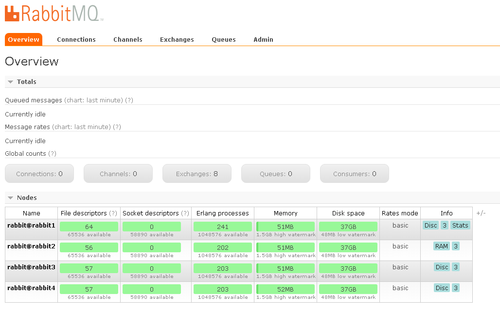

[](https://circleci.com/gh/bessonovevgen/docker-rabbitmq-cluster/tree/master)

Docker images to run RabbitMQ cluster. It extends the official image with a rabbitmq-cluster script that does the magic.

# Building

Once you clone the project locally use [captain](https://github.com/harbur/captain) to build the image or do with docker:

```
docker build -t rabbitmq-cluster .
```

# Running with docker-compose

If you want to run the cluster on one machine use [docker-compose](https://github.com/docker/compose/)

```
export PASSWD=yourareonlyone && docker-compose up -d
```

By default 4 nodes are started up this way:

* first node with management
* second node wtith RAM mode
* third and fourth nodes - simple with disk mode

If needed, additional nodes [can be added to this file](./docker-compose.yml).

Once cluster is up:
* The management console can be accessed at `http://hostip:15672`
* The connection host should look like this: `hostip:5672,hostip:5673,hostip:5674`



# Credits

* Inspired by https://github.com/bijukunjummen/docker-rabbitmq-cluster
* Some Russian Docs add to [this file](./docs/RU-README.md)
