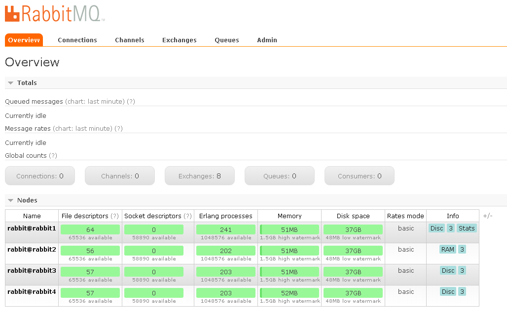

# Кластер RabbitMQ для проверки гипотез и концепций

мы основываемся на том что RabbitMQ - это очень классно и эффективно.
Однако кластеризация и вообще его настройка проблематична

В этом репозитории вы можете - быстро ставить свои жксперименты с кластером `docker-rabbit`, а для этого вам понадобится

## Установка

* установите `docker` и `docker-compose` - под Windows используйте https://www.docker.com/products/docker-toolbox
* склонируйте себе этот репозиторий 

```
git clone https://github.com/silverbulleters-forks/docker-rabbitmq-cluster
```

* выполните команду сборки

```
docker build -t rabbitmq-cluster .
```

* запустите кластер

```
docker-compose up -d
```

на порту http://ВашСервер:15672 вы должны увидеть 



## Настройка своего кластера

* отройте файл `docker-compose.yml`

отредактируйте его как вам необходимо - например добавив параметр `RAM=true`

* перезапустите кластер

```
docker-compose restart
```

### Лицензии и особенности

* данный репозиторий представляет собой ответвление от англоязычного https://github.com/harbur/docker-rabbitmq-cluster, с небольшими доработками
* лицензия указана в LICENSE файле
